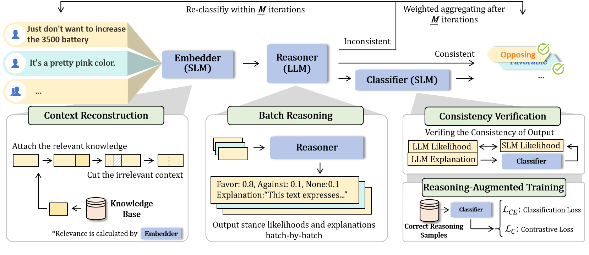

# Collaborative Stance Detection via Small-Large Language Model Consistency Verification

 

## Overview

This work is accepted by DASFAA2025 as a long paper.

This repository provides a **Stance Detection Framework** for efficiently detecting stances (e.g., Favor, Against, Neutral) from textual data. The system leverages a collaborative approach combining **Large Language Models (LLMs)** for nuanced reasoning and **Small Language Models (SLMs)** for efficient verification and classification. 



### Key Features:
1. **Context Reconstruction**: Enhances context with additional relevant information to improve classification accuracy.
2. **Batch Processing**: Efficiently processes multiple texts in a single query to reduce computational overhead.
3. **Consistency Verification**: Ensures alignment between LLM-generated reasoning and predictions using SLM verification.

---


## 📁 Project Structure


project_root/
├── datasets/                      # Dataset directory  
│   └── semeval2016/              # SemEval 2016 dataset  
│       └── hc/                   # Hillary Clinton related data (relevant knowledge)  
├── main.py                       # Main program entry (configures embedded model APIs)  
├── language_models.py            # Language model configuration  
├── saved_model/                  # Directory for saved models  
│   └── stanceberta_classifier/   # StanceBERTa classification model  
├── pic/                          # Image assets  
│   └── CoVer.png                 # System architecture diagram  
└── README.md                     # Project documentation file

---
## Components

### 1. **StanceEnhancer**
- **Description**: Prepares and processes texts by reconstructing contexts, calculating similarity scores, and determining entropy.
- **Functions**:
  - `_get_embedding`: Retrieves embeddings for input texts or templates.
  - `_calculate_similarity`: Computes cosine similarity between text embeddings.
  - `calculate_stance_entropy`: Evaluates stance prediction distribution using entropy.
  - `enhance_texts_with_knowledge`: Incorporates domain-specific knowledge to refine text context.

### 2. **StanceDetector**
- **Description**: Performs stance detection using collaborative reasoning and verification mechanisms.
- **Key Features**:
  - **Batch Processing**: Processes texts in batches to leverage shared contextual cues and reduce LLM queries.
  - **SLM Verification**: Verifies LLM predictions using smaller models for consistency and alignment.
  - **Result Aggregation**: Combines multiple predictions to improve classification confidence.

### 3. **KnowledgeExtractor**
- **Description**: Extracts and integrates knowledge from external sources to augment input texts.
- **Functions**:
  - `extract_knowledge`: Extracts domain-specific keywords, events, and discussions.
  - `update_knowledge_data`: Integrates newly extracted knowledge with existing datasets.

### 4. **Custom Metrics**
- Provides detailed evaluation metrics, including:
  - Accuracy, Precision, Recall, and F1 Score.
  - Specialized metrics for stance detection performance (`stance_f1`).

---

## How to Use

### Installation
1. Clone this repository:
   ```bash
   git clone https://github.com/xxx
   cd CoVer
   ```
2. Install dependencies:
   ```bash
   pip install torch transformers scikit-learn tqdm fastchat pandas openai
   ```

### Configuration
- Configure API keys for embedding models in `StanceEnhancer` in main.py and language_models.py:
  ```python
  enhancer = StanceEnhancer(api_key="your-api-key")
  ```

  ```python
    if "gpt" in self.model_name:

        client = OpenAI(
            base_url="xxx",
            api_key="xxx"
        )
    elif "local" in self.model_name:
        client = OpenAI(api_key='TOKEN',
                        base_url='xxx')

    else:
        client = OpenAI(api_key='xxx',
                        base_url='xxx')

  ```

### Run Stance Detection
1. Prepare input data:
   - Ensure data is in `.csv` format with fields for `text`, `target`, and `label`.
2. Execute the detection pipeline:
   ```bash
   python main.py
   ```

---

## Example Workflow

```python
# Step 1: Initialize the model
models = ["gpt-4o-mini"]
detector = StanceDetector(models)

# Step 2: Load the dataset
val_data = pd.read_csv("./datasets/semeval2016/hc/test.csv")

# Step 3: Run batch detection
detector.batch_run_detection(
    val_data, batch_size=32, target="stance detection target",
    language="en", knowledge_base="./datasets/knowledge_data.json"
)
```

---

## Evaluation

- The framework supports evaluation using standard metrics:
  - **Accuracy**
  - **F1 Score (Macro, Average for Favor and Against Stances)**
  - **Confusion Matrices** for detailed analysis of predictions.

---

## Future Work

1. **Multimodal Extensions**: Expand to support multimodal input data (e.g., images, videos).
2. **Scalability**: Improve handling of larger datasets and longer reasoning inputs.
3. **Enhanced Knowledge Integration**: Automatically fetch and integrate knowledge from external sources in real-time.

---

## 📚 Citation

To cite this work, please use the following BibTeX entry:

```bibtex
@article{yan2025collaborative,
  title={Collaborative Stance Detection via Small-Large Language Model Consistency Verification},
  author={Yan, Yu and Sun, Sheng and Tang, Zixiang and Liu, Teli and Liu, Min},
  journal={arXiv preprint arXiv:2502.19954},
  year={2025}
}


---
## License
This repository is licensed under the MIT License. See the `LICENSE` file for more details.
